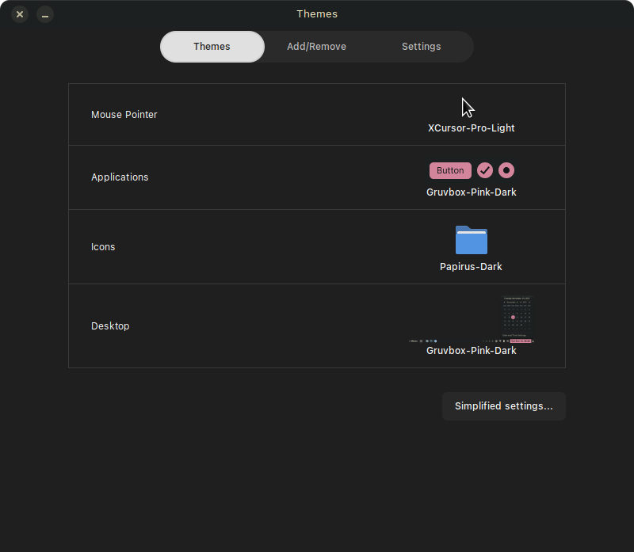
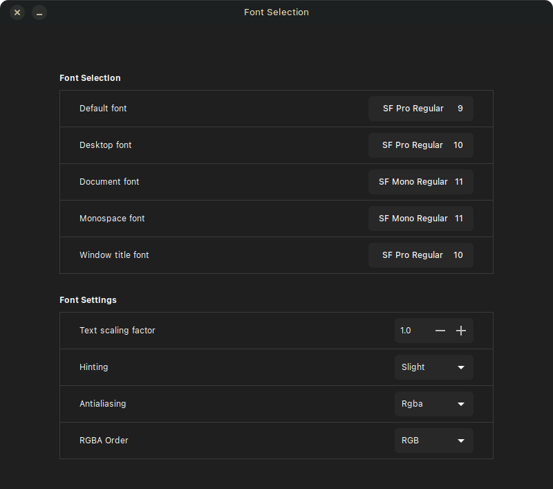

# Basics

[Gruvbox - GTK theme](https://github.com/Fausto-Korpsvart/Gruvbox-GTK-Theme)

[Papirus - Icons](https://github.com/PapirusDevelopmentTeam/papirus-icon-theme)

[XCursor Pro](https://github.com/ful1e5/XCursor-pro)

[Arborealis - Wallpaper](https://discuss-cdn.kde.org/uploads/default/e0bffc0b4a21ccb7e183c5502062b7c64c45e4e5)

[City Pixel Art - Wallpaper](https://wallpaperaccess.com/city-pixel-art)

### Fonts

See [here](docs/Apple_Fonts.md)

# By App

### Firefox

[Arkenfox - privacy](https://github.com/arkenfox/user.js)

[overrides - prefs](firefox/user-overrides.js)

### Alacritty

[Colour schemes](https://github.com/alacritty/alacritty-theme)

### Plymouth

["simplefuture"](https://github.com/volkavich/simplefuture)

### Spotify

[spicetify](https://spicetify.app/docs/advanced-usage/installation/)

["spicetify-themes"](https://github.com/spicetify/spicetify-themes)
